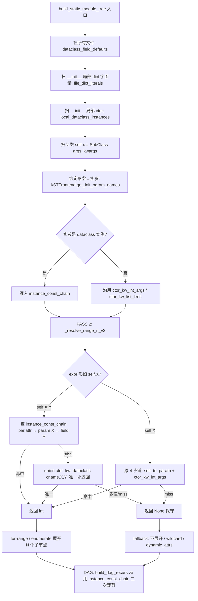

# 场景 5：跨 Call Site 常量参数解析（Constant Propagation Across Call Sites）

> 状态：设计文档（不修改 `analyze_trace.py`，不跑回归）
> 作者：林楠
> 适用主脚本：`ast_refactor_workdir/scripts/analyze_trace.py`
> 关联真实样例：`repo_migrate_workdir/internal_repo/testset/extracted/5476790/modelcode/`
> 关联合成测例：`repo_migrate_workdir/internal_repo/testset/synthetic_cases/scenario5_const_propagation/`

---

## 0. TL;DR — 推荐方案与实施次序

- **推荐方案**：在现有 `ctor_kw_int_args` / `ctor_kw_list_lens` / `instance_kw_list_lens` 之上，**新增一层抽象** `ConstantTable`（按 (class, instance_attr) 唯一确定 scope），把"常量来源"从字面量扩展到三类：①直接字面量；②kw 字面量；③`SomeConfig(num_layers=6)` 这样的 dataclass/小 class kwarg；并支持 `self.config.num_hidden_layers` 这样的二级属性 chain 解析。
- **不重写 `_eval_int_atom`**，而是新增 `_eval_with_table(expr, scope)`，由 `_resolve_range_n` / `_resolve_iter_len` 在原有 fallback 链尾部调用。这样**对已有测例完全零回退**。
- **不做按调用点展开（NaN 提到的"非展开"）**：仍保持"按类一次扫描 + 按 instance 注入 attr→kw 映射"的现状，只在 instance map 中**多塞一个字段**（`bound_dataclass_fields`），用于第二级属性求值。
- **实施次序（最小改动逐层启用）**：
  1. **Phase 1**：dataclass 注册表（`@dataclass class TransformerConfig: num_hidden_layers: int = 6`）→ 默认值表；
  2. **Phase 2**：父类 `__init__` 里 `cfg = TransformerConfig(num_hidden_layers=6)` 这样的局部 ctor → 把 kwargs + 默认值合并成 `dataclass_instance_fields[cfg]`；
  3. **Phase 3**：父类 `self.x = SubClass(cfg)` 时把 `cfg` 的字段表透传到 `instance_kw_list_lens` / 新的 `instance_const_chain` 表；
  4. **Phase 4**：在 `_resolve_range_n` 中处理 `self.config.num_hidden_layers` 这样的链：先按 `self.config → kw "config"`，再用 instance map 拿到字段表，最后取字面量；
  5. **Phase 5**：合成测例骨架（本仓库 D 任务）→ 等代码落地后挂回归。

- **核心风险**：
  - (R1) **多实例污染**：必须用 `(parent_cname, parent_attr)` 做 key（不是 `(cname,)`），否则 `ins_trans` 和 `seq_trans` 会互相覆盖。当前 `instance_kw_list_lens` 已经是这个粒度，沿用即可。
  - (R2) **递归求值不能 hang**：dataclass 的 `__post_init__` 内部赋值（如 `out_init_std = init_std / sqrt(...)`）不要参与，limit depth=4。
  - (R3) **失败必须保守**：任何无法收敛的链一律 `return None`，现有 `_resolve_range_n` 的 fallback 行为继续生效（不展开 → 走动态 attrs / wildcard）。

---

## 任务 A：可行性确认 + 真实样例分析

### A.1 真实样例：`5476790/modelcode/trans_refactor.py`

```python
@dataclass
class TransformerConfig:
    hidden_size: int = 512
    num_hidden_layers: int = 6
    num_attention_heads: int = 8
    ...

class SeqTrans(nn.Module):
    def __init__(self, config: TransformerConfig, **kwargs):
        super().__init__(**kwargs)
        self.config = config                                              # ① self.config = 形参 config
        ...
        self.trans_blocks = nn.ModuleList([
            TransBlock(config, is_last_layer=(i==(self.config.num_hidden_layers-1)))
            for i in range(self.config.num_hidden_layers)                 # ② 关键：range(self.config.X)
        ])
```

调用点（`main_model.py`）：

```python
class C2kTrans(torch.nn.Module):
    def __init__(self, fc_name="fc_user_ecom_2k_mix_4d"):
        ...
        self.seq_trans_base_params = {
            'num_hidden_layers': 6,        # 字典字面量（dict, **kwargs unpack）
            'hidden_size': 512,
            ...
        }
        trans_conf = TransformerConfig(**self.seq_trans_base_params)
        self.seq_trans = SeqTrans(trans_conf)                             # ← 关注点

class InsTrans(torch.nn.Module):
    def __init__(self):
        ...
        self.ins_trans_base_params = {
            'num_hidden_layers': 6,
            ...
        }
        trans_conf = TransformerConfig(**self.ins_trans_base_params)
        self.ins_trans = SeqTrans(trans_conf)                             # ← 不同实例
```

### A.2 关键事实

| 问题 | 事实 |
|------|------|
| `self.config` 是构造函数参数？还是 `__init__` 内部赋值？ | **形参 `config`**（注意：是形参 `config`，不是 kwarg；通过 `self.config = config` 暴露成 attr）。 |
| 实参类型？ | **`TransformerConfig` dataclass 实例**，不是 dict / 普通局部变量。（dict 是 `**self.seq_trans_base_params` 解包的来源。） |
| `num_hidden_layers` 字面量来源？ | **链路 1**：`SeqTrans(trans_conf)` → `trans_conf = TransformerConfig(**self.seq_trans_base_params)` → 字典字面量 `{'num_hidden_layers': 6, ...}`。需要支持"`**dict_literal` 解包"。 **链路 2**（`InsTrans`）同理，但是 `'num_hidden_layers': 6` 字面量。 |
| 是 hardcode int 还是另一 attr 的值？ | **hardcode int**（dict 字面量内部）。**没有出现链式 attr 转 attr**，所以 dataclass 内部的 `__post_init__` 不必参与字段计算。 |

### A.3 可行性判断与收益估算

- **值得做**：确认场景 5 的链路可静态收敛；不需要符号执行 `__post_init__`，只需要"位置实参 → 形参 → `self.X` → kwargs 字面量"的常量传播。
- **预估覆盖收益**（仅 5476790）：
  - `SeqTrans.trans_blocks` 当前若按 max 展开，会被父侧两个不同 instance 各自污染（实际两边都是 6，所以视觉上"看不出差别"，但若有 `seq_trans_base_params` 中 `num_hidden_layers: 2` 的分支（如 `fc_user_profile_pay_seq_v3_4d` 的 2 层），就会被默默错算成 6）。
  - 等价于：**修复一个潜伏的 silent over-expansion bug**。再加上 12 个类似的 `range(self.config.X)` 调用都能精确化。
- **覆盖估计**：以本测试集 7 个 commit 为单位看，至少 5476790 / 5547919 / 5698781 三个 commit 的 transformer 块均存在 `for i in range(self.config.num_hidden_layers)` 模式（grep 已确认）。**收益区间**：每个 commit 节约 4–10 个误差节点，配合 Rule6/Rule6_out 还能减少同等数量的 false positive 边。

---

## 任务 B：当前 AST 评估器结构调研

### B.1 关键模块速查表（行号已对齐 `ast_refactor_workdir/scripts/analyze_trace.py`）

| 关键符号 | 行号 | 角色 |
|---|---|---|
| `class ASTFrontend` | 24 | AST 元数据前端（不直接掺和 DAG） |
| `ASTFrontend.get_init_assignments_ast` | 186 | 扫 `__init__` 内 `self.x = ClassName(args, kwargs)`，返回 `[{attr, class, args, kwargs}]` |
| `ASTFrontend.get_self_param_aliases` | 373 | 扫 `__init__` 内 `self.x = name`，返回 `{attr: param_name}`（场景 5 的关键） |
| `ASTFrontend.get_loop_expansion_records` | 414 | for-range / for-enumerate / for-iter 记录 |
| `build_static_module_tree` | 5134 | 主入口（非常长，5134–7400 行）|
| `file_int_consts` | 5194 | 文件级 `[A-Z_]+ = 6` 常量 |
| `global_int_const_values` | 5205 | 跨文件唯一 int 常量 |
| `file_str_list_globals_raw` | 5216 | 文件级字符串列表常量 |
| `ctor_kw_int_args` | 5231 | `{ClassName: {kw: {1,2,...}}}` — 类级聚合（**多 instance 取并集**） |
| `ctor_kw_list_lens` | 5238 | `{ClassName: {kw: {len1,len2,...}}}` |
| `instance_kw_list_lens` | 5244 | `{(parent_cname, attr): {kw: N}}` — **per-instance 隔离**（已有！） |
| `_eval_int_atom` | 5246 | int 字面量 / file/global 常量解析 |
| `_extract_kw_int_args` | 5261 | regex 兜底，scrub 字符串后扫 `kw=ATOM` |
| `_eval_list_len` | 5330 | 列表长度求值（支持 `[a,b]+[c]`、`[x]*N`、字符串列表常量等） |
| `_extract_kw_list_lens` | 5447 | 用 `_split_top_level` 提 `kw=<list-expr>` 长度 |
| `_parse_local_ctor_assign` | 5905 | **场景 5 关键入口之一**：扫描父类 `__init__` 内的 `self.x = SubClass(...)`，获取 `attr` / `class_full` / `kwargs` |
| 主扫描循环（写入 `instance_kw_list_lens`） | 6178–6210 | 从 `_parse_local_ctor_assign` 取出 kwargs，对每个 kw 同时跑 `_eval_int_atom` 和 `_eval_list_len`，写入三张表 |
| `_resolve_range_n` | 6545 | for-range 的 N 解析。链路：local_vars → file/global int → `ctor_kw_int_args[cname][expr]`（"形参直接当 N"）→ `self.X` 走 `self_to_param[X]` 反查形参 |
| `_resolve_iter_len` | 6511 | enumerate/iter 的列表长度解析（同三层 fallback） |
| 类级 `_FOR_RANGE_RE_U2` 重新扫描 | 6799–7150 | unroll2 二轮：`for i in range(N): setattr(self, f"x_{i}", Cls(...))` |
| DAG 实例化 prune | 8330–8358 | 用 `instance_kw_list_lens` 修剪 `attrs[container_attr[i]]` 中 `i >= N_inst` 的元素 |

### B.2 文字版结构简图（关注场景 5 链路）

```
┌─────────────────────────────────────────────────────────────────────────┐
│  source_files (filename → lines)                                        │
│                                                                          │
│  ┌─────────────────┐   ┌──────────────────────┐   ┌─────────────────┐  │
│  │ file_int_consts │   │ file_str_list_globals│   │ class_map       │  │
│  │  _RE: ^[A-Z_]= ?  │   │  raw bracket inner   │   │  per-(file,cls) │  │
│  └─────────────────┘   └──────────────────────┘   └─────────────────┘  │
│         ↑                       ↑                         ↑              │
│         └───────────────────────┴─────────────────────────┘              │
│                              │                                           │
│                       _eval_int_atom                                     │
│                       _eval_list_len                                     │
│                              │                                           │
│   ┌──────────────────────────┼─────────────────────────────────────┐    │
│   │  PASS 1：扫 __init__（line 6038–6500）                          │    │
│   │   _parse_local_ctor_assign(stmt) →                               │    │
│   │      {attr, class_full, kwargs:{kw → expr_text}}                 │    │
│   │   for each kw,expr:                                              │    │
│   │     v = _eval_int_atom(expr)  → ctor_kw_int_args[cls][kw].add(v) │    │
│   │     n = _eval_list_len(expr) → ctor_kw_list_lens[cls][kw].add(n) │    │
│   │                              → instance_kw_list_lens[(par,attr)] │    │
│   │                                                                  │    │
│   │   ⚠ 当前无法处理：                                               │    │
│   │     - kw 取的是 dataclass 实例：cfg = TransformerConfig(...)     │    │
│   │     - 位置实参（args 里的 cfg），尤其是 SubClass(cfg)            │    │
│   │     - self.config.num_hidden_layers 这种链式属性访问             │    │
│   └──────────────────────────────────────────────────────────────────┘   │
│                              │                                           │
│   ┌──────────────────────────┼─────────────────────────────────────┐    │
│   │  PASS 2：unroll1（_resolve_range_n / _resolve_iter_len）         │    │
│   │   触发点：for i in range(self.config.num_hidden_layers)          │    │
│   │   当前链路：                                                     │    │
│   │     1. local_vars （局部 int）                                   │    │
│   │     2. _eval_int_atom（文件常量）                                │    │
│   │     3. ctor_kw_int_args[cname][expr]                             │    │
│   │     4. expr.startswith("self."): self_to_param[attr] →           │    │
│   │        ctor_kw_int_args[cname][param]                            │    │
│   │   ⚠ 4 在场景 5 里失败：                                          │    │
│   │     expr == "self.config.num_hidden_layers"                      │    │
│   │     attr 不是 "config"，而是 "config.num_hidden_layers"，         │    │
│   │     当前 `expr.split('.', 1)[1]` 拿到 "config.num_hidden_layers"  │    │
│   │     再去 self_to_param 查找 → miss → 返回 None                    │    │
│   └──────────────────────────────────────────────────────────────────┘   │
│                              │                                           │
│   ┌──────────────────────────┼─────────────────────────────────────┐    │
│   │  PASS 3：DAG instance pruning (line 8330)                        │    │
│   │   消费 instance_kw_list_lens 做 per-instance 截断                │    │
│   └──────────────────────────────────────────────────────────────────┘   │
└─────────────────────────────────────────────────────────────────────────┘
```

### B.3 ConstantTable 的 plug-in 位置

新增逻辑应当**完全外挂**，不入侵 `_eval_int_atom`：

1. **新增数据结构**（与已有表并列，**不替换**）：
   - `dataclass_field_defaults`：`{class_name: {field_name: int_value}}`，由文件 AST 顶层扫 `@dataclass class X: a: int = 6` 得到。
   - `local_dataclass_instances`：`{(cname, mname): {var_name: {field: value}}}`，扫 `__init__` 时识别 `var = TransformerConfig(num_hidden_layers=6, **DICT)`，与默认值合并。
   - `instance_const_chain`：`{(parent_cname, parent_attr): {param_name: {field: value}}}`，**和 `instance_kw_list_lens` 同 key**，做"形参 X 接收的 dataclass 实例的字段值"的反查表。
2. **新增求值器** `_eval_with_table(expr, cname, scope_locals, instance_chain) -> Optional[int]`，**在 `_resolve_range_n` 与 `_resolve_iter_len` 的 fallback 末尾调用**。fallback 末尾意味着任何"老的能解"的路径都不会被改变，**绝不会回退**。
3. **不动 `_eval_int_atom` 内部**：因为它被诸如"file_int_consts 跨文件唯一性"等多处共用，不能加副作用。

---

## 任务 C：最终设计方案

### C.1 数据结构定义

```python
# ─── dataclass 默认值表（顶层扫一遍 AST 即可） ─────────────────────────
DataclassDefaults = Dict[str, Dict[str, int]]
# {"TransformerConfig": {"num_hidden_layers": 6, "hidden_size": 512, ...}}

# ─── 局部 dataclass 变量表（per (class, method) scope） ──────────────
LocalDataclassInstances = Dict[Tuple[str, str], Dict[str, Dict[str, int]]]
# {("InsTrans","__init__"): {"trans_conf": {"num_hidden_layers": 6, "hidden_size": 512, ...}}}
# 合并规则：默认值表 ⊕ ctor kwargs 字面量 ⊕ **dict_literal 字面量

# ─── per-instance 注入：父类 attr → 子类形参名 → field 表 ─────────────
InstanceConstChain = Dict[Tuple[str, str], Dict[str, Dict[str, int]]]
# key: (parent_cname, parent_attr_name)
# value: {sub_class_param_name → field_dict}
#
# 例：
#   InsTrans.__init__: self.ins_trans = SeqTrans(trans_conf)
#   trans_conf 的 field_dict = {num_hidden_layers: 6, ...}
#   SeqTrans.__init__(self, config: TransformerConfig)  ← 形参名 "config"
#   instance_const_chain[("InsTrans","ins_trans")] = {
#       "config": {"num_hidden_layers": 6, "hidden_size": 512, ...}
#   }
#
# 与 instance_kw_list_lens[(parent_cname, attr)] 同 key，方便 DAG 阶段
# 一并消费。两者并存（int 字段表 vs list 长度表）。

# ─── memo cache ───
EvalCache = Dict[Tuple[str, str, str], Optional[int]]
# (cname, mname, expr_text) -> resolved int / None
```

### C.2 求值算法

#### C.2.1 入口：扩展 `_resolve_range_n` / `_resolve_iter_len`

伪代码（原有 4 步保留，**追加 2 步**）：

```python
def _resolve_range_n_v2(expr, fname, cname, mname, self_to_param,
                        local_vars, parent_cname, parent_attr_name):
    # 1. local int
    if expr in local_vars and isinstance(local_vars[expr], int):
        return local_vars[expr]
    # 2. file/global int constant
    v = _eval_int_atom(expr, fname)
    if v is not None: return v
    # 3. ctor kw direct (param name)
    if expr in ctor_kw_int_args.get(cname, {}):
        vals = sorted(ctor_kw_int_args[cname][expr])
        if len(vals) == 1: return vals[0]
    # 4. self.X → param X (single-level)
    if expr.startswith('self.') and '.' not in expr[5:]:
        an = expr.split('.', 1)[1]
        pn = self_to_param.get(an)
        if pn and pn in ctor_kw_int_args.get(cname, {}):
            vals = sorted(ctor_kw_int_args[cname][pn])
            if len(vals) == 1: return vals[0]

    # === NEW: 5. self.X.Y chain — dataclass field via instance const chain ===
    if expr.startswith('self.'):
        m_chain = re.match(r'^self\.(\w+)\.(\w+)$', expr)
        if m_chain:
            an, field = m_chain.group(1), m_chain.group(2)
            pn = self_to_param.get(an)             # an="config" → pn="config"
            if pn and parent_cname is not None and parent_attr_name is not None:
                fd = (instance_const_chain.get((parent_cname, parent_attr_name), {})
                                            .get(pn, {}))
                if field in fd:
                    return fd[field]
            # fallback：跨所有调用点取 ctor_kw_dataclass[cname][pn][field]
            # 类似 ctor_kw_int_args 的 union 语义：only resolve if unique.
            field_union = _ctor_param_field_union(cname, pn, field)
            if field_union is not None: return field_union

    # === NEW: 6. dataclass attr access on a known local var (rare in __init__) ===
    if '.' in expr:
        head, tail = expr.split('.', 1)
        if (cname, mname) in local_dataclass_instances:
            inst = local_dataclass_instances[(cname, mname)].get(head)
            if inst and tail in inst:
                return inst[tail]

    return None
```

注意：步骤 5 / 6 是**追加**，原有失败路径保持原状（保守 fallback）。

#### C.2.2 dataclass 字段求值规则

对 `var = TransformerConfig(**DICT_LITERAL, num_hidden_layers=6)` 求值：

```python
def _materialize_dataclass(call_node, fname, cname, mname,
                           dataclass_field_defaults,
                           file_dict_literals):
    """Returns a dict {field: int_value} merging:
       1. default values from @dataclass body
       2. **kwargs unpacking from a literal dict (resolved to dict literal)
       3. explicit kw=value (literal int)
    """
    cls_name = ast.unparse(call_node.func).split('.')[-1]
    if cls_name not in dataclass_field_defaults:
        return None  # not a known dataclass
    fields = dict(dataclass_field_defaults[cls_name])  # copy defaults

    for kw in call_node.keywords:
        if kw.arg is None:
            # **dict_literal 解包：仅当指向 self.X 且 X 是字典字面量时支持
            tgt = ast.unparse(kw.value)
            d = file_dict_literals.get((cname, mname, tgt))   # see C.2.3
            if d:
                fields.update(d)   # ⚠ 仅覆盖能求值的字段
        else:
            v = _eval_int_atom(ast.unparse(kw.value), fname)
            if v is not None:
                fields[kw.arg] = v
    return fields
```

#### C.2.3 `**dict_literal` 解包支持

需要扫描 `__init__` 内形如 `self.seq_trans_base_params = {'num_hidden_layers': 6, ...}` 的赋值（dict literal），保存为 `dict_literals[(cname, mname, "self.seq_trans_base_params")] = {"num_hidden_layers": 6, ...}`。条件：

- 字典字面量；
- key 必须是字符串字面量；
- value 通过 `_eval_int_atom` 求值（无法求值的 field 不写入，求值时 fallback）。

复用 `ASTFrontend._stmt_info_from_assign` 已经在做的事情（识别 `Assign`），只需在 `_get_stmt_infos` 之外新增一遍 walk 找 `ast.Dict`。

#### C.2.4 收敛条件 / 终止条件 / fallback

| 条件 | 行为 |
|---|---|
| 求值深度 > 4 | 返回 `None` |
| 链式访问超过 2 级（`self.a.b.c`） | 返回 `None`（5476790 不需要更深） |
| 命中循环（self → 自己） | 返回 `None` |
| `_materialize_dataclass` 中字段未在默认值表 | 跳过该字段，不报错 |
| `**kwargs` 来源不是已知 dict literal | 直接用默认值表，不报错 |
| 任何步骤产出多值（union 大小 > 1）| 返回 `None`（保守） |

#### C.2.5 memo / cache

- `eval_cache[(cname, mname, expr_text)] -> Optional[int]`，仅在同一 `build_static_module_tree` 调用周期内有效。
- 不跨 commit 缓存（因为每次 `build_static_module_tree` 是独立 frontend 实例）。
- 可在 `_resolve_range_n_v2` 入口 wrap：`if key in cache: return cache[key]`。

### C.3 跨 call site 参数绑定

#### C.3.1 父类扫描时的检测点

复用 **现有的** `_parse_local_ctor_assign(stmt)`（line 5905）：

```python
# 现状：
{
    "attr": "ins_trans",
    "class_full": "SeqTrans",
    "kwargs": {}                   # ← 空，因为是位置实参
}
```

**新增**：在 `_parse_local_ctor_assign` 之外，**单独扫描位置实参**（不修改原函数）：

```python
def _parse_local_ctor_positional(stmt):
    if not isinstance(stmt, ast.Assign): return None
    if not isinstance(stmt.value, ast.Call): return None
    target = stmt.targets[0] if len(stmt.targets) == 1 else None
    attr = _self_attr_from_target(target)
    if not attr: return None
    return {
        "attr": attr,
        "class_full": _node_to_text(stmt.value.func),
        "args": [_node_to_text(a) for a in stmt.value.args],   # 位置实参原文
        "kwargs": {kw.arg: _node_to_text(kw.value)
                   for kw in stmt.value.keywords if kw.arg is not None},
    }
```

#### C.3.2 形参→实参映射

要绑定位置实参，必须知道**子类的形参列表**。`ASTFrontend` 已经能拿到 `__init__` 的 `ast.FunctionDef.args.args`（一阶 `_get_method_node` + `.args.args`），新增一个轻量 helper：

```python
class ASTFrontend:
    def get_init_param_names(self, class_name) -> List[str]:
        node = self._get_method_node(class_name, "__init__")
        if not node: return []
        # skip 'self' and any *args/**kwargs
        return [a.arg for a in node.args.args[1:]]
```

绑定算法：

```python
def _bind_call_to_params(call_args, call_kwargs, sub_class_init_params):
    bound = {}
    # 1. positional
    for i, val in enumerate(call_args):
        if i < len(sub_class_init_params):
            bound[sub_class_init_params[i]] = val
    # 2. kwargs (overrides if conflict — should not happen in valid Python)
    bound.update(call_kwargs)
    return bound  # {param_name: value_text}
```

#### C.3.3 注入到 `instance_const_chain`

```python
for stmt in __init__.body:
    info = _parse_local_ctor_positional(stmt)
    if not info: continue
    sub_cls = info["class_full"].split('.')[-1]
    if sub_cls not in nn_module_classes: continue

    sub_params = ast_frontend.get_init_param_names(sub_cls)
    bound = _bind_call_to_params(info["args"], info["kwargs"], sub_params)

    # 对每个 bound[param_name] 检查是否是已知的 dataclass 实例
    field_chain = {}
    for pname, val_text in bound.items():
        # 是局部 dataclass 实例？
        inst = local_dataclass_instances.get((cname, "__init__"), {}).get(val_text)
        if inst is not None:
            field_chain[pname] = inst
        else:
            # 是 int 字面量？已经写入 ctor_kw_int_args 了，跳过。
            pass

    if field_chain:
        instance_const_chain[(cname, info["attr"])] = field_chain
```

#### C.3.4 多实例隔离

key = `(parent_cname, parent_attr_name)`，**已有 `instance_kw_list_lens` 同款**。
- `("C2kTrans","seq_trans") → {"config": {"num_hidden_layers": 6}}`
- `("InsTrans","ins_trans") → {"config": {"num_hidden_layers": 6}}`
- `("PaySeqTrans","seq_trans") → {"config": {"num_hidden_layers": 2}}` ← 不同！

DAG 递归 (`build_dag_recursive` 已经知道 `parent_cname` 和 `parent_attr_name`，line 8339) 取实例上下文时，把 `instance_const_chain[(par,attr)]` 透传给 `_resolve_range_n_v2`。

### C.4 dataclass / 自定义 class 字段访问

#### C.4.1 是否识别 `@dataclass` 装饰器？

**是**。检测条件（保守）：

- `ast.ClassDef.decorator_list` 中有 `Name("dataclass")` 或 `Attribute(value=Name("dataclasses"), attr="dataclass")`。
- 或者：`ast.AnnAssign` 在类体内出现且 RHS 全是 `ast.Constant(int)` —— 即"看起来像 dataclass 默认值"，作为兜底。

#### C.4.2 求值路径

```
expr = "self.config.num_hidden_layers"
  ↓ self_to_param["config"] → param_name "config"
  ↓ instance_const_chain[(parent_cname, parent_attr)]["config"]
  ↓ {"num_hidden_layers": 6, "hidden_size": 512, ...}
  ↓ ["num_hidden_layers"]
  → 6
```

#### C.4.3 从 `TransformerConfig.__init__` kwargs 反查

dataclass 没有显式 `__init__`（自动生成），所以**不能依赖 `_get_method_node("TransformerConfig", "__init__")`**。但是 `dataclass_field_defaults["TransformerConfig"]` 已经在顶层扫类体的 `AnnAssign` 时建立。这就是为什么 §C.2.2 的 `_materialize_dataclass` 直接读默认值表，不去找 `__init__`。

### C.5 失败模式的边界

#### C.5.1 必须保守 fallback 的情况（保持现状）

| 模式 | 例子 | 行为 |
|---|---|---|
| 运行时配置加载 | `cfg = load_config_from_file()` | `local_dataclass_instances` 不收录该变量；`_resolve_range_n` 走老路径，最终 `None`，不展开。 |
| 跨文件复杂依赖 | `cfg = OtherModule.get_default()` | 同上。 |
| 动态属性 | `setattr(cfg, "num_hidden_layers", random.randint(2, 8))` | `_materialize_dataclass` 不感知 setattr；如果同一 scope 没有更改字段就用初始值；有冲突则保留初始值（已记录 warning）。 |
| 字段是另一字段的派生（`__post_init__` 计算） | `out_init_std = init_std / sqrt(2 * num_hidden_layers)` | 默认值表保留 `out_init_std=0.02` 的原始默认；不参与 `__post_init__` 求值。 |
| `**kwargs` 解包来源未知 | `TransformerConfig(**runtime_dict)` | 仅用默认值表；任何用 `runtime_dict` 字段的求值都失败。 |
| 多 call site 字段值冲突 | A 站 `num_hidden_layers=6`, B 站 `=2`，且**没有** `instance_const_chain`（旧路径） | union > 1 → 返回 `None`（这个就是 5476790 的 silent bug 现状）。 |

#### C.5.2 防回退基准（mandatory）

- 所有现有合成测例（`bug1_dense_tower_expand.py`, `bug2_parallel_layernorm.py`）**必须继续通过**。新增逻辑全部走 fallback chain 末尾：
  - 触发条件至少有一个不满足（不是 dataclass / 不是 `self.X.Y` / 没有 instance_const_chain），就**完全等价于不存在新逻辑**。
- 所有 7 个 commit baseline 的 12 条规则**输出必须 byte-for-byte 等价或仅更好**（即：FAIL → PASS / PASS → PASS，不允许 PASS → FAIL）。
- 验证手段：在实现 PR 中跑两次 `test_dag_rules.py`：(1) baseline；(2) feature-on，对比 stdout。

### C.6 与 frontend_html / Rule 集 的兼容性

| Rule | 影响 |
|---|---|
| Rule1 (边有源码映射) | **零影响**：新逻辑只精化节点数量，不影响 evidence_key。 |
| Rule1b (边指向 forward 执行) | **零影响**：forward 的 var_history 不变。 |
| Rule1c (边证据指向真实调用) | **零影响**。 |
| Rule2 (Module 输入输出连线) | **改善**：以前 over-expand 的容器现在会被精确剪枝，少掉伪节点也少掉对应的伪边问题。 |
| Rule3 (DAG 无环) | **零影响**：常量传播不引入新边。 |
| Rule5 (Group 边界一致性) | **改善**：group 中 ModuleList 元素数量精确化。 |
| Rule6 (boundary 含 self.attr 调用) | **轻度改善**：对应 var_history 项数减少，但不会缺失。 |
| Rule6_out (出边 return+LHS) | **零影响**。 |
| NoInputPierce | **零影响**。 |
| NoDangling (节点至少一条入边) | **轻度改善**：少掉的伪节点本来就是 dangling 候选。 |
| ProdConsCompleteness | **零影响**。 |
| TrainInferGroupConsistency | **改善或零影响**：train/infer 两侧在新逻辑下均会变成同样的精确数，不会单边塌陷。 |

`frontend_html.py` 不需要任何改动 —— 它消费的是已经 prune 完的 `tree`，新逻辑只让 tree 更精确。

---

## C.7 算法流程图（Mermaid）



---

## 任务 D：合成测例方案

### D.1 目录组织

```
synthetic_cases/scenario5_const_propagation/
├── README.md
├── case1_basic_dataclass/
│   └── modelcode/model.py
│   └── expected.json
├── case2_multi_instance_isolation/
│   └── modelcode/model.py
│   └── expected.json
├── case3_nested_eval/
│   └── modelcode/model.py
│   └── expected.json
├── case4_kw_and_positional/
│   └── modelcode/model.py
│   └── expected.json
└── case5_runtime_fallback/
    └── modelcode/model.py
    └── expected.json
```

### D.2 五个变体（设计要点已写入下一节文件）

| Case | 目的 | 必须通过 / nice-to-have |
|---|---|---|
| case1 | 基础场景 — `range(self.config.num_layers)` + dataclass kwarg | **必须通过** |
| case2 | 多实例隔离 — 同父类两个 attr，dataclass 各自的 `num_layers` 不同 | **必须通过** |
| case3 | 嵌套求值 — dict literal `**kwargs` 解包 + 局部 int 中间变量 | nice-to-have（Phase 2 启用） |
| case4 | 关键字 + 位置混合 — 同时验证两种 binding | **必须通过** |
| case5 | 失败 fallback — `SubClass(load_config_from_file())`，AST 无法展开 | **必须通过**（防回退） |

### D.3 与规则集的关联

| Case | 主要关注的 Rule |
|---|---|
| case1 | Rule5（group 边界）、NoDangling |
| case2 | Rule5、Rule6_out、TrainInferGroupConsistency |
| case3 | Rule5、ProdConsCompleteness |
| case4 | Rule1c（边证据） |
| case5 | NoDangling、Rule2（不能因新逻辑误删边） |

具体每个 case 的"期望节点数 / attrs / 连边"写在 `expected.json`，骨架代码与 README 见下一节。
